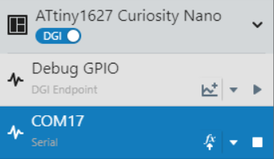
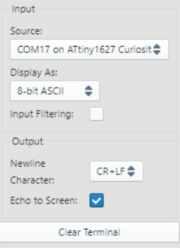
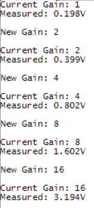

<!-- Please do not change this logo with link -->

# Using the ADC and PGA on the ATtiny1627 Family
The ATtiny1627 family of microcontrollers contains an Analog-to-Digital Converter (ADC) with an embedded Programmable Gain Amplifier (PGA). This demo shows the PGA and ADC by acquiring a PGA amplified sample once per second. Other peripherals used in this demo include the Real-Time Counter (RTC), Event System (EVSYS) and the Configurable Custom Logic (CCL).

## Related Documentation

- [ATtiny1627 Documentation](https://www.microchip.com/wwwproducts/en/ATTINY1627?utm_source=GitHub&utm_medium=TextLink&utm_campaign=MCU8_MMTCha_attiny1627&utm_content=attiny1627-analog-demo-mplab-mcc-github)

## Software Used

- [MPLAB® X IDE v5.50 or newer](https://www.microchip.com/en-us/development-tools-tools-and-software/mplab-x-ide?utm_source=GitHub&utm_medium=TextLink&utm_campaign=MCU8_MMTCha_attiny1627&utm_content=attiny1627-analog-demo-mplab-mcc-github)
- [MPLAB XC8 v2.30 or newer](https://www.microchip.com/en-us/development-tools-tools-and-software/mplab-xc-compilers?utm_source=GitHub&utm_medium=TextLink&utm_campaign=MCU8_MMTCha_attiny1627&utm_content=attiny1627-analog-demo-mplab-mcc-github)
- [MPLAB Code Configurator (MCC) v4.2.3](https://www.microchip.com/en-us/development-tools-tools-and-software/embedded-software-center/mplab-code-configurator?utm_source=GitHub&utm_medium=TextLink&utm_campaign=MCU8_MMTCha_attiny1627&utm_content=attiny1627-analog-demo-mplab-mcc-github)
  - [Melody Library v1.84.5](https://www.microchip.com/en-us/development-tools-tools-and-software/embedded-software-center/mplab-code-configurator?utm_source=GitHub&utm_medium=TextLink&utm_campaign=MCU8_MMTCha_attiny1627&utm_content=attiny1627-analog-demo-mplab-mcc-github)
- [ATtiny_DFP v2.7.128 or newer](https://packs.download.microchip.com/)
- [MPLAB Data Visualizer Plugin](https://www.microchip.com/en-us/development-tools-tools-and-software/embedded-software-center/mplab-data-visualizer?utm_source=GitHub&utm_medium=TextLink&utm_campaign=MCU8_MMTCha_attiny1627&utm_content=attiny1627-analog-demo-mplab-mcc-github) or serial terminal

## Hardware Used

- [ATtiny1627 Curiosity Nano Evaluation Kit (DM080104)](https://www.microchip.com/DevelopmentTools/ProductDetails/PartNO/DM080104?utm_source=GitHub&utm_medium=TextLink&utm_campaign=MCU8_MMTCha_attiny1627&utm_content=attiny1627-analog-demo-mplab-mcc-github)
- Variable Power Supply or Other Signal Source
- Breadboard and Wire (for connecting)
  
## I/O Setup

| I/O Pin | Name
| ------  | ----
| RB2 | UART TX
| RB3 | UART RX (unused)  
| RB5 | Analog Input (+)
| RB7 | LED0
| RC4 | Switch 0 (SW0)

## Peripheral Configuration

**UART** - 9600 Baud, 8-bits, No Parity, 1 Stop Bit  
**ADC** - Single Sample, Triggered on Event (Channel 0), VREF = VDD  
**RTC** -  1kHz Internal Oscillator   
**EVSYS** - Channel 0 Event Generator: RTC / 1024

## Setting MPLAB Data Visualizer

First, open Data Visualizer by pressing the "DV" icon in the toolbar.

*If this icon is not shown, please install MPLAB Data Visualizer in the Tools &rarr; Plugins window before continuing.*

Then select the COM port associated with the Curiosity Nano by clicking on COM port entry. Set any settings required in the box below (defaults are OK for this example).

Press the play button to open the COM port.

Finally, set the terminal window to use the COM port as a data source.

## Regenerating the API

**Caution! If regenerating the MCC API, please be careful when merging changes to avoid overwriting the modified ISR handlers. This will break functionality.**

When code can't be merged, MCC asks the user to approve changes by pressing the arrow or X next to the relevant change. Closing the window will decline any unapproved changes.

## Operation

This demo operates by periodically amplifying then measuring the input signal to the ADC. This occurs approximately once per second.

LED0 on the microcontroller toggles when ready to print a result. The current gain of the PGA and the result are printed to the UART terminal at 9600 baud (see example image below). Once the UART is idle, then the microcontroller enters standby sleep to save power.

To switch gains, the input signal from SW0 is debounced by a CCL. The rising edge interrupt from the CCL wakes the microcontroller to:

- Stop the RTC
- Modify the gain of the PGA (1x, 2x, 4x, 8x, 16x, then repeat)
- Print the new gain to the terminal
- Restart the RTC
- Return to standby sleep

## Summary
This demo has shown the PGA functionality in the ATtiny1627 family of microcontrollers.
