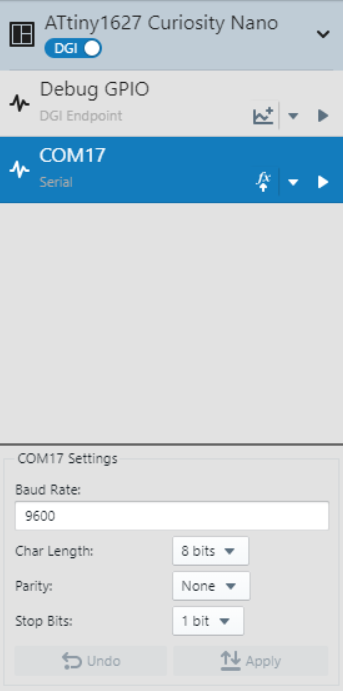

<!-- Please do not change this logo with link -->

# Signal Scaling with the ADC and PGA on the ATtiny1627 Family
The ATtiny1627 family of microcontrollers contains an Analog-to-Digital Converter (ADC) with an embedded Programmable Gain Amplifier (PGA). This demo shows the PGA and ADC by acquiring a PGA amplified sample once per second. Other peripherals used in this demo include the Real-Time Counter (RTC), Event System (EVSYS) and the Configurable Custom Logic (CCL).

## Related Documentation

- [ATtiny1627 Documentation](https://www.microchip.com/wwwproducts/en/ATTINY1627?utm_source=GitHub&utm_medium=TextLink&utm_campaign=MCU8_MMTCha_attiny1627&utm_content=attiny1627-analog-demo-mplab-mcc-github)

## Software Used

- [MPLAB® X IDE v5.50 or newer](https://www.microchip.com/en-us/development-tools-tools-and-software/mplab-x-ide?utm_source=GitHub&utm_medium=TextLink&utm_campaign=MCU8_MMTCha_attiny1627&utm_content=attiny1627-analog-demo-mplab-mcc-github)
- [MPLAB XC8 v2.30 or newer](https://www.microchip.com/en-us/development-tools-tools-and-software/mplab-xc-compilers?utm_source=GitHub&utm_medium=TextLink&utm_campaign=MCU8_MMTCha_attiny1627&utm_content=attiny1627-analog-demo-mplab-mcc-github)
- [MPLAB Code Configurator (MCC) v4.2.3](https://www.microchip.com/en-us/development-tools-tools-and-software/embedded-software-center/mplab-code-configurator?utm_source=GitHub&utm_medium=TextLink&utm_campaign=MCU8_MMTCha_attiny1627&utm_content=attiny1627-analog-demo-mplab-mcc-github)
  - [Melody Library v1.84.5](https://www.microchip.com/en-us/development-tools-tools-and-software/embedded-software-center/mplab-code-configurator?utm_source=GitHub&utm_medium=TextLink&utm_campaign=MCU8_MMTCha_attiny1627&utm_content=attiny1627-analog-demo-mplab-mcc-github)
- [ATtiny_DFP v2.7.128 or newer](https://packs.download.microchip.com/)
- [MPLAB Data Visualizer Plugin](https://www.microchip.com/en-us/development-tools-tools-and-software/embedded-software-center/mplab-data-visualizer?utm_source=GitHub&utm_medium=TextLink&utm_campaign=MCU8_MMTCha_attiny1627&utm_content=attiny1627-analog-demo-mplab-mcc-github) or serial terminal

## Hardware Used

- [ATtiny1627 Curiosity Nano Evaluation Kit (DM080104)](https://www.microchip.com/DevelopmentTools/ProductDetails/PartNO/DM080104?utm_source=GitHub&utm_medium=TextLink&utm_campaign=MCU8_MMTCha_attiny1627&utm_content=attiny1627-analog-demo-mplab-mcc-github)
  - Running at 3.3V (default)
- Variable Power Supply or Other Signal Source
- Breadboard and Wire (for connecting)

## Enabling Floating Point Printf Support

To enable floating point Printf support on AVR devices, add the following settings to the XC8 linker options:

`-Wl,-u,vfprintf -lprintf_flt -lm`

## I/O Setup

| I/O Pin | Name
| ------  | ----
| RB2 | UART TX
| RB3 | UART RX (unused)  
| RB5 | Analog Input (+)
| RB7 | LED0
| RC4 | Switch 0 (SW0)

## Peripheral Configuration

**UART** - 9600 Baud, 8-bits, No Parity, 1 Stop Bit, Printf support  
**ADC** (Non-PGA Settings) - Single Sample, Triggered on Event (Channel 0), AQ time = 100 cycles, VREF = VDD, Run Standby (set in main)  
**ADC** (PGA Settings) - PGA Enabled and Connected, PGA Sample Time = 6 Cycles, 1/4 Bias Current  
**RTC** -  1kHz Internal Oscillator, PIT Enabled, PIT Period = OFF  
**EVSYS** - Channel 0 Event Generator: RTC / 1024  
**CCL** - Connected to SW0, Run Standby, D-input Flip-Flop Synchronized to 1 kHz internal oscillator, Filter Enabled

## Setting MPLAB Data Visualizer

The first step is to open the MPLAB Data Visualizer tool by pressing the "DV" icon in the toolbar as shown below.

*If this icon is not shown, please install MPLAB Data Visualizer in the Tools &rarr; Plugins window before continuing.*

Then select the COM port associated with the Curiosity Nano  by clicking on COM port entry. Set any settings required in the box below (defaults are OK for this example).

When the correct COM port has been selected and the Data Visualizer settings are set, press the play button to open the COM port.

Once the COM port has been opened, the last step is to set the terminal window to use the COM port as a data source.

## Regenerating the API

**Caution! If regenerating the MCC API, please be careful when merging changes to avoid overwriting the modified ISR handlers. This will break functionality.**

When code can't be auto-merged, MCC asks the user to approve changes by pressing the arrow or X next to the relevant change. Closing the merge tab/window will decline any unapproved changes.

## Operation

This demo periodically amplifies then acquires a single-ended analog input signal to the ADC, then prints the measured result about once per second.

LED0 on the microcontroller toggles when ready to print a result. The current gain of the PGA and the result are printed to the UART terminal at 9600 baud (see example image below). Once the UART is idle, then the microcontroller enters Standby Sleep to save power.

To switch the set gain, the input signal from SW0 is debounced by a CCL. The rising edge interrupt from the CCL wakes the microcontroller to:

1. Stop the RTC
2. Modify the gain of the PGA (1x, 2x, 4x, 8x, 16x, then repeat)
3. Print the new gain to the terminal
4. Restart the RTC
5. Return to Standby Sleep

## Summary
This demo has demonstrated the PGA functionality of the ADC to acquire small signals in the ATtiny1627 family of microcontrollers.
